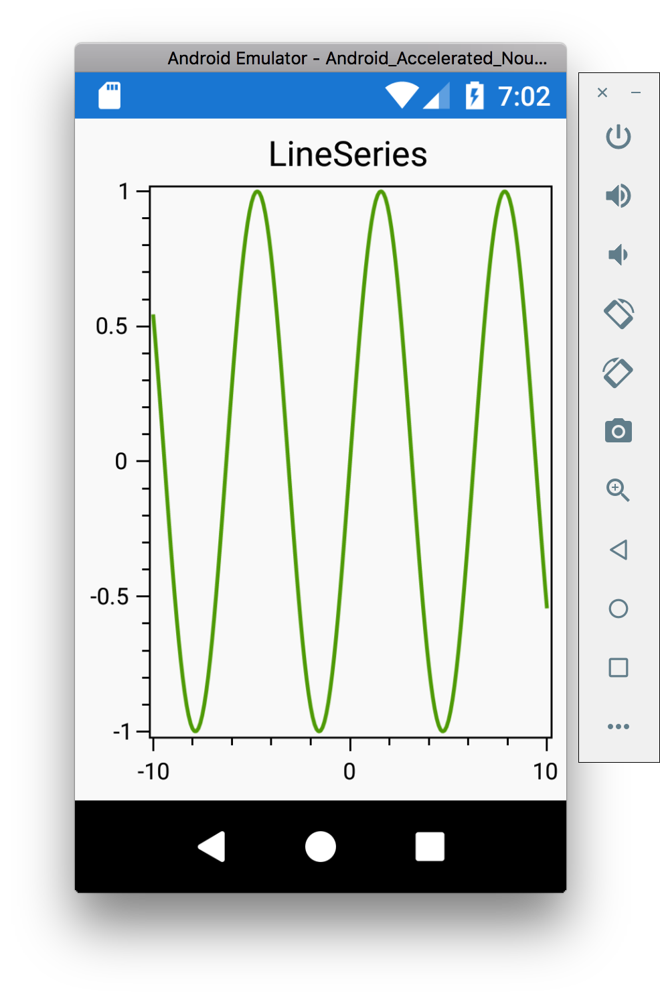
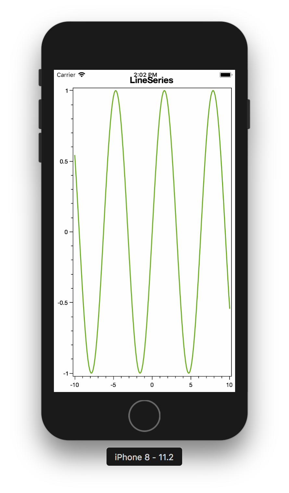

# OxyPlotDemo
First look at OxyPlot

## Documentation
[OxyPlot Documentation](http://docs.oxyplot.org/en/latest/index.html)

## Description
This project is my first look at the capabilities of OxyPlot. So far it looks fairly powerful.

The screenshots show the same function 

`f(x) = sin(x)`

## Notes

This is a Xamarin.Forms application

## Screenshots
Android | iOS
--------|--------
 | 
